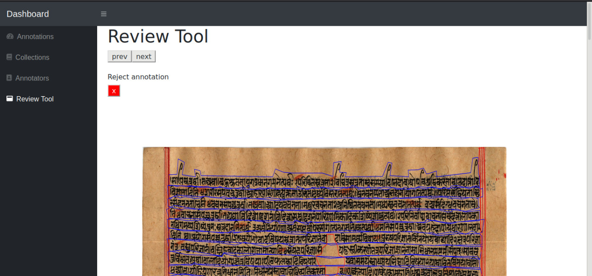

# Instruction Manual for Review Tool:

## Contents:
- [Getting Started](#Getting-Started)
    - [Within Docker](within-docker)
- [Protocols](#Protocols)
- [Future Work](#Future-Work)
## Getting Started:

### Within Docker:

1. The **annotation tool** uses a docker with image named 'hindola/local'.

2. To test if the docker is running 
- run `docker ps -a`
- If you do not see docker with the image name `hindola/local` kindly contact administrators of the annotation tool (Presently : Aaron, Pranav , Khadiravana)
- To enter into a running docker run the command `docker exec -it container-id /bin/bash` , where container id can be found on running `docker ps -a`.
- run `cd dashboard/Flask`
- To run the tool , run `flask run --host=10.4.16.102 --port=5100`
- Then visit http://10.4.16.102:5100/
- Click on the gallery viewer, you should see images loaded.

## Protocols:

- There are basically three buttons that are there in the Review Tool  :
    - next
    - previous
    - reject.
- After an image loads, to accept the annotation, simply go to the next image by clicking on  the next button.
- To **Reject** an annotation, click on the `Reject annotation` button (the button having the cross mark).
- The next and previous buttons do exactly what they have to do. They go to the next and previous images retrireved from the database.
- Note that the images loaded to you will only be those that have been annotated but **NOT** reviewed.
- However, while you are on the Reviewer Page, the latest Images accepted by you will  be displayed on pressing the previous button. Note that this should help the reviewer to reject an annotation that he/she has accepted (by pressing the next button) without intending to do so.

## Future Work:

- Integrate the correction tool
